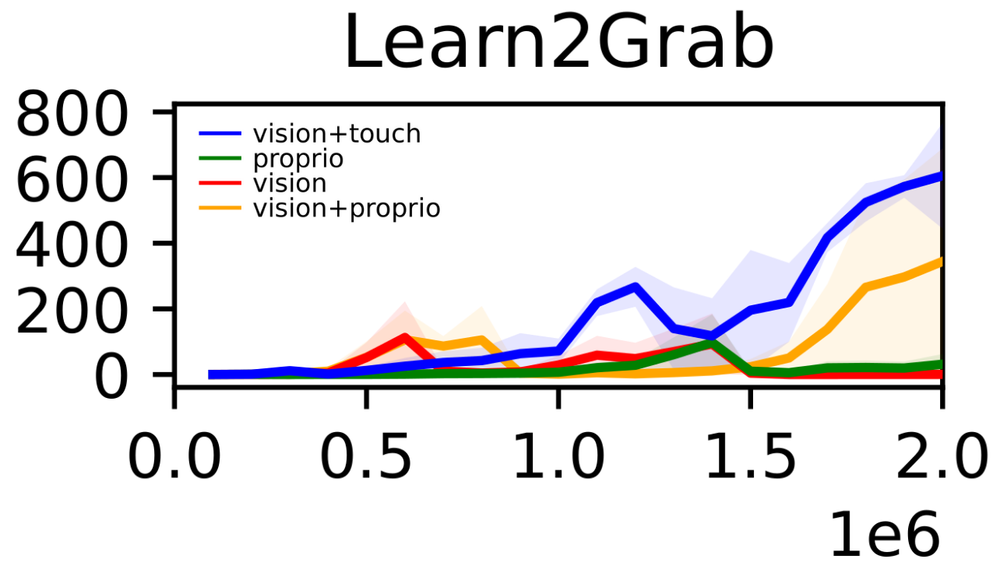
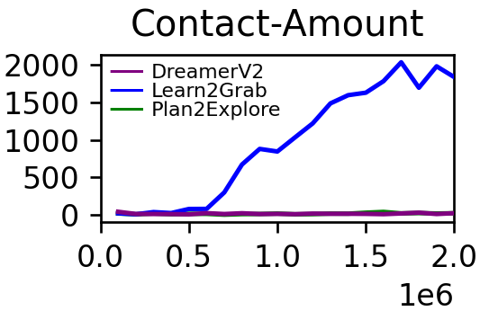
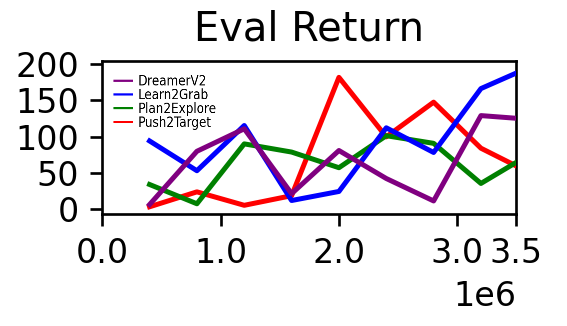
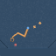
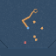

# Learning world models by self-supervised exploration (tum-adlr-ws22-02)

This project introduces an adapted version of Plan2Explore, where an agent builds a world model trained in a self-supervised manner.

## todo
- update paper

## Introduction
The prevailing approach to sensorimotor control involves training an agent on specific tasks using rewards in reinforcement learning. However, this method often proves to be inefficient as each task requires a significant amount of task-specific environment interaction to solve from scratch.

For additional details, please see our paper:  
"[Learning world models by self-supervised exploration](https://github.com/flo-stilz/3D-Visual-Grounding-with-Transformers/blob/lang-det/paper%20%26%20figures/final_submission_3D_visual_grounding_with_transformers.pdf)"  
by [Stefan Frisch](https://github.com/ga92xug) and [Florian Stilz](https://github.com/flo-stilz/)
from the [Technical University of Munich](https://www.tum.de/en/). 

## Setup
For the setup and dataset preparation please check the DreamerV2 [github page](https://github.com/danijar/dreamerv2). One notable thing is that the Plan2Explore version in DreamerV2 only trains until half of the steps that are specified in expl_until. This mistake was fixed in this repo.

## Results
- Proprioceptive information: we added sensory information for the fingers to the model input.
- Intrinsic motivation: by using some environment specific clues we introduce a much richer exploration signal that should help the agent to explore the environment more efficiently and to built a better world model. For that we introduce the biologically inspired Learn2Grab and Stacking reward.
- Push2Target: to further simplify the task, we introduce an additional dense reward that only tracks the x-coordinate of the target. 

### Learn2Grab results:

   

### Task performance:

## Fails
These are some of the more interesting ways how the agent solved the respective subtasks Learn2Grab, Learn2Grab and Stacking ordered from left to right.

      

